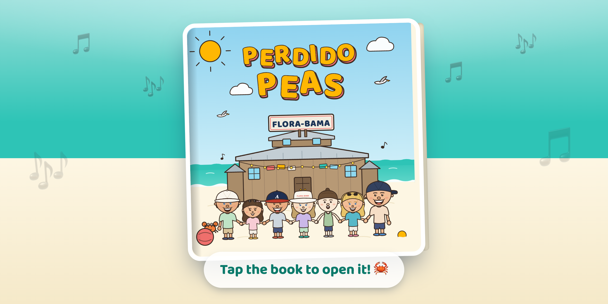

<p align="center">
  <a href="https://perdido-peas-web-production.ian-b42.workers.dev">
    
  </a>
</p>

<h1 align="center">Perdido Peas</h1>

<p align="center">
  <strong>A children's picture book, written, illustrated, and published end to end with AI in about 2 hours.</strong><br>
  Built to get my friends excited for a beach trip. Open-sourced so you can make your own.
</p>

<p align="center">
  <a href="https://perdido-peas-web-production.ian-b42.workers.dev"><strong>📖 Read the finished book</strong></a>
</p>

---

## What this is

I had a beach trip coming up with a group of friends, so I spent about two hours making them a short rhyming picture book to get everyone hyped. The book itself is a personal in-joke; the interesting part is **how it was made**: written, illustrated, laid out, and published as an interactive web reader without a single hand-drawn line or stock illustration. Every page, every character, and the cover were **generated as code** and rendered to print-ready art.

That's why this repo is open source. It's a **worked example of how to write a children's book with AI**: a reusable, prompt-by-prompt process you can copy for your own picture book. If you searched for *how to make a children's book with AI*, *AI children's book generator*, *AI storybook illustrations*, or *self-publish a picture book*, start with [The reusable process](#the-reusable-process-how-to-write-a-childrens-book-with-ai) below.

- **Live reader:** https://perdido-peas-web-production.ian-b42.workers.dev
- **Manuscript (text + per-page illustration briefs):** [book.md](book.md)
- **Illustration engine:** [open-assets](https://www.npmjs.com/package/@open-assets/open-assets) (HTML/CSS/SVG rendered to PNG)
- **Web reader:** Next.js 16 app in [web/](web/)

---

## The reusable process: how to write a children's book with AI

The whole book came from a chain of plain-English prompts to [Claude Code](https://claude.com/claude-code). The exact wording was specific to *Perdido Peas*, but the **shape of the process is fully reusable**. Below is the generalized version: seven steps, each with a copy-and-paste prompt template. Swap in your own title, plot, cast, and setting.

The core idea that makes it work: **write the words first, build a reusable cast of characters second, and only then generate pages.** Because every character is one reusable component, the art stays consistent across every page by construction, which is the single hardest part of *making a picture book with AI*.

### Step 1 - Write the manuscript first (words before pictures)

Nail the text and a per-page illustration brief *before* drawing anything. One markdown file becomes the single source of truth.

```text
I'm writing a children's book titled "[TITLE]", by [AUTHOR].

Here is the plot:
- [beat 1: how it opens]
- [beat 2]
- [beat 3]
- [the turn / low point]
- [the discovery]
- [the happy ending]

Here's some inspiration for the voice and the world:
[a favorite quote, running jokes, music, foods, real places, in-jokes].

Keep it short and make it rhyme.

Start by writing ONE markdown file with a section per page: the page text
plus an illustration brief for that page. We'll confirm the text before we
draw anything. Standard picture-book size, and the art style must stay
consistent across every page.
```

### Step 2 - Tighten the story

Read it out loud, then cut and rename until it sings. Keep editing the same markdown file.

```text
Revise the manuscript: remove [X] and [Y], rename [A] to [B], and cut the
[references] entirely. Change "[old line]" to "[new line]".
```

### Step 3 - Build a reusable cast of characters

This is the step that guarantees consistency. Each character becomes **one reusable vector component**, drawn once and reused on every page.

```text
Set up the illustration pipeline with open-assets (see how my other repos use
it). Make a characters/ folder and start with [HERO] as a single reusable SVG
component. Add simple props too (like a crab) so the same art can be reused on
every page. Standard children's book size; style consistent across all pages.
```

Then hand it the cast in one shot:

```text
Here's the cast. Render each as its own reusable character:
- [Name]: [hair, eyes, build, signature hat/accessory, palette]
- [Name]: [...]
- [Name]: [...]
```

Then iterate **one note at a time** (this is where the quality comes from):

```text
Improve [character]: [one specific fix].
```
Real examples from this book: *"the cap should sit behind the head,"* *"make the arms a single filled shape, not stacked strokes,"* *"give the girls longer, wavier hair as one shape,"* *"make the hat actually sit on her head."*

Lock in canon rules so they hold on every future page:

```text
Note for all future art: [rule].
```
(Here: *"Eric's cap is always backwards; in any side shot the bill points fully behind him."* Also a hidden easter egg: *"a small orange crab is hidden on every page."*)

Add the supporting cast the same way:

```text
Add supporting critters as reusable components: a crab, a seagull, a turtle.
Anything else that fits the world?
```

### Step 4 - Compose the cover from the components

Because the characters already exist as components, the cover is assembly, not redrawing.

```text
For the cover: put all the friends together on the beach in this order
[order], holding hands, with [landmark] and its sign in the background.
Put the title in big bubbly hand-lettered letters in the sky.
```

Then art-direct like a picky editor:

```text
[one fix]: make the building two stories so it reads as further away /
add a small bocce ball in the sand next to [hero] / remove the stray line
through the waves.
```

### Step 5 - Scale to every page with a workflow

With the cast, the cover, and the style locked, the remaining pages fan out in parallel.

```text
The cover is done. Now kick off a workflow to build all the remaining pages:
one agent per page, then an art-director review pass across a few lenses
(consistency, palette, anatomy, composition), then a fix-and-verify pass per
page.
```

Apply global corrections in one line and let them propagate:

```text
[character] needs to be [change] on every page (for reference, [canon fact,
e.g. heights]).
```

### Step 6 - Build a web reader

Ship the book as something people can actually open on their phone.

```text
Map a web/ directory: a simple Next.js app that hosts the book. Export
placeholder page images first to simulate the output format. Start on the
closed cover; tapping it opens the book with a page-fold animation; navigate
with arrow keys, swipe, and tap; show a page counter; make it mobile-first;
pick a color scheme that complements the book.
```

Then polish the feel:

```text
The page turn should fold at the spine exactly like the cover. Match the page
counter to the nav buttons.
```

### Step 7 - Ship it

```text
Use the Vercel MCP to create a project for this repo and claim the [subdomain]
subdomain if it's available.

Turn the cover into an OG image for the site. Clone the cover template first,
don't modify the cover directly.
```

That's the whole method. **Words first, reusable characters second, pages third, reader fourth, deploy last.**

---

## How the illustrations work: the open-assets pipeline

The art is **not** AI-generated raster imagery. Every page is an HTML/CSS/SVG template rendered to PNG by [open-assets](https://www.npmjs.com/package/@open-assets/open-assets), a Puppeteer-based "Storybook for marketing assets." It loads each template in headless Chromium and screenshots it, so the output is crisp vector art at any size, versioned in git and diffable in a PR.

Every character/prop lives as a standalone SVG in `public/characters/` (`eric.svg`, `crab.svg`, ...) with palette colors baked in. Page templates reuse them via ``, so the same art appears on every page **by construction**. Pose variants (hand-holding, running, toasting) live in subdirectories and are generated by rotating the arm paths around the shoulder pivot. The banner at the top of this README is itself an open-assets template ([assets/banner/banner.html](assets/banner/banner.html)) that reuses those same character components.

### Project layout

```
perdido-peas/
  assets.json             # manifest: collections (characters, pages, og, banner...)
  assets.lock             # incremental render cache (commit it)
  book.md                 # manuscript: per-page text + illustration briefs
  src/styles.css          # Tailwind input (@import "tailwindcss")
  public/                 # shared art: character SVGs, textures, fonts
    characters/           # one reusable SVG per character + critters
    banner/banner.png     # this README's banner (rendered by open-assets)
  assets/
    characters/*.html     # one template per character (renders the SVGs)
    pages/*.html          # one template per book page (2550x2550)
    og/og-cover.html      # Open Graph image
    banner/banner.html    # README banner (clone of the web reader home page)
  exports/                # rendered PNGs (commit them)
  web/                    # Next.js interactive reader
```

### Commands

```bash
npm run dev      # live preview UI at localhost:3200 (zoom/pan, export buttons)
npm run render   # build CSS, then render every template incrementally
npx open-assets render --collection banner --force   # re-render just the banner
```

- Output: one PNG per template per export size, e.g. `exports/pages/{template}.png`
- `outFile` can send a rendered size anywhere (the web reader reads from `web/public/pages/`)
- **Gotcha:** `assets.lock` only checksums HTML/SVG source, not images in `public/`. After swapping art, render with `--force` or unchanged-looking pages get skipped.

### Book format decisions

- **Trim:** 8.5" x 8.5" square, rendered at 2550 x 2550 px (300 DPI).
- `sourceSize` = export size, so CSS `zoom` = 1 and embedded art renders 1:1 and stays crisp.
- **Print caveat:** output is RGB PNG with no DPI metadata, no CMYK, no bleed. A print step must tag DPI / convert color; bake bleed into `sourceSize` (2625 x 2625 for 0.125") if the printer needs it.

---

## The web reader

A [Next.js 16](web/) app (dev port 3400). It opens on the closed book, plays a 3D cover-open animation on tap, and turns pages with a spine-hinged fold via tap zones, swipe, or arrow keys, with a page-counter pill and Escape to close. Palette: sand `#fdf6e3`, gulf `#2ec4b6`, sunshine `#ffb703`, coral `#ef6f6c`, cap-navy `#1d3557`, in Baloo 2. Real page renders drop into `web/public/pages/` at fixed filenames.

```bash
cd web && npm run dev   # http://localhost:3400
```

---

## FAQ

**How do you write a children's book with AI?**
Write the rhyming text and a per-page illustration brief first (Step 1), then build a reusable cast of characters, then generate the pages from those characters. Doing the words first and the reusable art second is what keeps a whole book coherent. Follow [The reusable process](#the-reusable-process-how-to-write-a-childrens-book-with-ai) above.

**How do you keep the character art consistent across every page?**
Draw each character exactly once as a reusable vector component and reuse it on every page, rather than re-generating art per page. Consistency then comes for free. This is the biggest advantage of a component/code pipeline over per-page AI image generation, which tends to drift in style, faces, and proportions.

**Can I use this to make my own AI picture book?**
Yes. Fork the repo, replace `book.md` with your story, swap the character SVGs in `public/characters/`, and re-render. The seven-step prompt process is written to be copied.

**Is the art AI image generation or code?**
Code. Every illustration is HTML/CSS/SVG rendered to PNG by open-assets, so it is version-controlled, diffable, editable by hand, and print-ready at any resolution, unlike a flat generated raster image.

**How do I self-publish or print it?**
The pages export at 2550 x 2550 px (300 DPI) for an 8.5" square trim. Add bleed and tag DPI / convert to CMYK in a print step before sending to a print-on-demand service.

---

*Perdido Peas is a personalized gift book made in about two hours for a group of friends (the "Perdido Peas") ahead of a beach trip. Written with [Claude Code](https://claude.com/claude-code), illustrated with [open-assets](https://www.npmjs.com/package/@open-assets/open-assets).*
